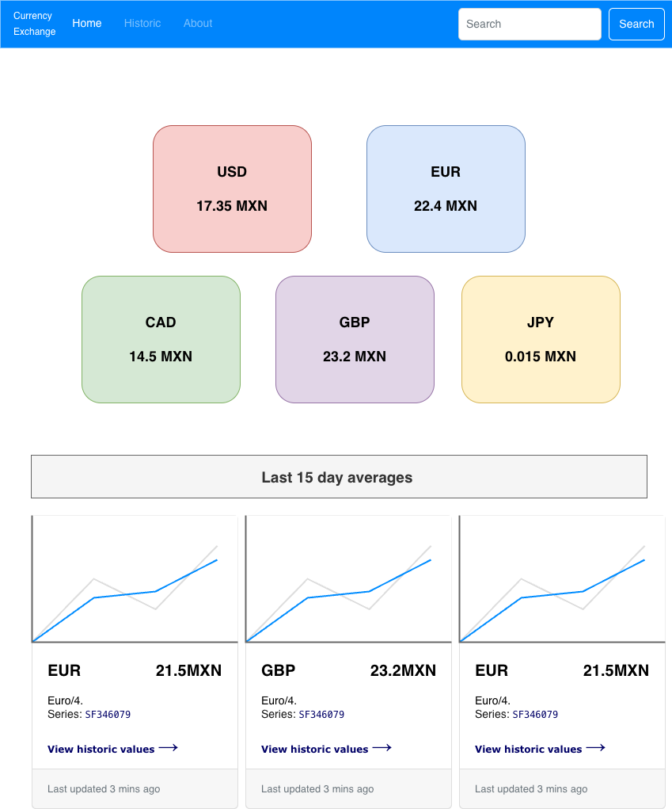
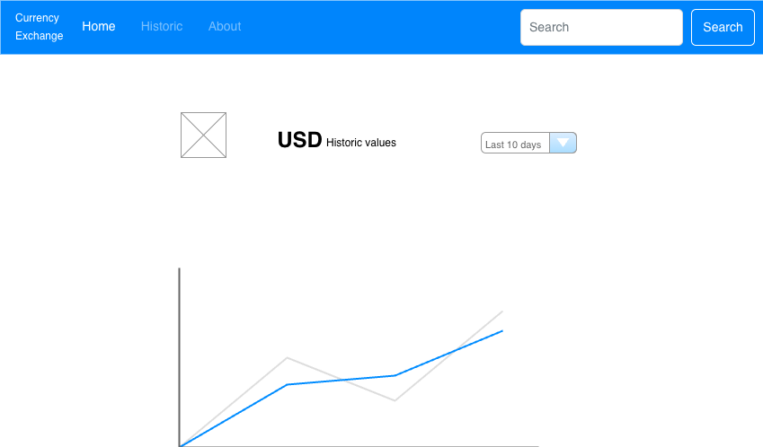
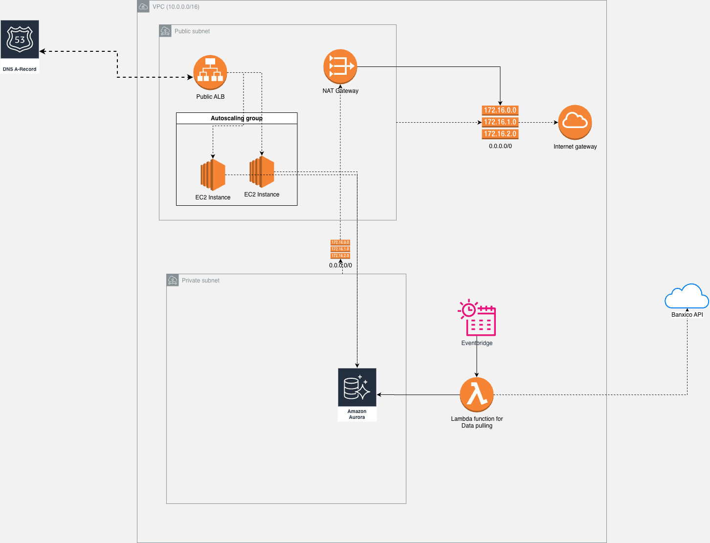

# Currency Exchange Project

## Application overview
The Currency Exchange service is a web-based platform that provides users with real-time currency exchange rates and historical data. The application fetches exchange rate data from a reliable third-party API and displays it in an intuitive user interface. Users can view current exchange rates, compare historical trends, and access detailed information about various currencies including USD.

The application is designed to be highly available and scalable, ensuring that users can access the information they need at any time and to accomplish that all the currency information is stored in a MySQL database, which is updated regularly with the latest exchange rates, this information is collected using AWS Lambda functions triggered by EventBridge, the function uses Banxico public API to fetch the data on a scheduled basis, once the information is collected and stored it can be consulted by the backend service and display at the frontend where it includes most recient data visualization and historical trend analysis to enhance the user experience.

The website is designed with a focus on usability and accessibility, making it easy for users to navigate and find the information they need. The user is presented with panel of currency cards arranged in a mosaic grid layout, each card displays the currency symbol, code, exchange rate against MXN, full currency name, last updated timestamp, and rate date. The design incorporates smooth animations and transitions to enhance the overall user experience.

The website offers a visualization of the historic values for the last 10 days per currency and averages for the last 15 days, allowing users to analyze trends over time.
## API Endpoints
- Healthcheck `/api/health`
- Exchange rates retrieval `/api/rates/latest` and `/api/rates/:currencyCode` with optional filters `currencyCode`, `startDate`, `endDate`, `limit`
- Currencies management `/api/currencies`

## Database Schema
- `currencies` - Stores currency metadata (code, name, Banxico series ID)
- `exchange_rates` - Stores historical exchange rate data (`series_id`, `currency_code`, `exchange_rate`, `date`, `updated_at`, `created_at`)
    - Unique constraint on (series_id, date) to prevent duplicate entries
    - Indexed for fast queries by currency code and date
- `sync_logs` - Tracks API synchronization history (`sync_type`, `status`, `records_processed`, `error_message`, `started_at`, `completed_at`)

### Mockup Design



#### Customer Expectations
In order to define SLI/SLO's we must understand what are the customer expectations from the service, so the following list serves as a ground base to define the SLI/SLO's:
- The service needs to available in bussiness hours.
- The service must respond fast at any given time.
- The service must have data accuracy of 99.99%.


### SLIs and SLOs
 Based on the customer expectations the following SLI/SLO table is defined:
| Category      | SLI | SLO
| ------------- | ------- | ------- |
| **Frontend**
| Availability  |  Success rate is defined as the count of HTTP status code other than 5xx over the total requests reported by the Load Balancer ```(count(HTTPCode_Target_2XX_Count) + count(HTTPCode_Target_3XX_Count) + count(HTTPCode_Target_4XX_Count) / RequestCount``` |  99.95% success rate |
| Latency       |  Fast response time is defined as the 95th percentile of request latency reported by the Load Balancer below 2 seconds ```Percentile(0.95,TargetResponseTime) ``` |  95% of requests under 2000ms  |
| Error Rate    |  HTTP 5xx errors divided by total requests reported by the Load Balancer ```count(HTTPCode_Target_5XX_Count) / RequestCount``` |  Errors < 0.05% of total requests |
| **Backend**
| Availability  |  Success rate is defined as the count of HTTP status code other than 5xx over the total requests reported by the Load Balancer ```(count(HTTPCode_Target_2XX_Count) + count(HTTPCode_Target_3XX_Count) + count(HTTPCode_Target_4XX_Count) / RequestCount``` |  99.95% success rate |
| Latency       |  Fast response time defined as the 95th percentile of request latency reported by the Load Balancer below 0.2 seconds ```Percentile(0.95,TargetResponseTime) ``` |  95% of requests under 200ms  |
| Error Rate    |  HTTP 5xx errors divided by total requests reported by the Load Balancer ```count(HTTPCode_Target_5XX_Count) / RequestCount``` |  Errors < 0.05% of total requests |
| **Lambdas**
| Availability  |  Success rate defined as the proportion of invocations - error_invocations over total invocations ```count(invocations - error_invocations) / count(invocations)``` |  99.95% success rate |
| Latency       |  Lambda Function duration defined as the 95th percentile of invocation duration ```Percentile(0.95,Duration) ``` |  95% of requests under 1 minute  |
| Error Rate    |  Sum of errors over total invocations ```sum(errors) / sum(invocations)``` |  Error rate < 0.05% of total requests |

## Architecture 
The Currency Exchange application is built using modern web technologies and follows best practices for performance and security. The frontend is developed using React.js, providing a responsive and interactive user interface. The backend is powered by Node.js and Express.js, handling API requests and data processing. The application uses a MySQL database to store historical exchange rate data, ensuring data integrity and reliability.

| Component        | Technology/Service |
|------------------|--------------------|
| Frontend         | React.js           |
| Backend          | Node.js, Express.js|
| Database         | MySQL (Amazon RDS) |
| Hosting          | AWS ECS Fargate    |
| Load Balancer    | AWS ELB            |
| Third-Party API  | Banxico            |
| Monitoring       | AWS CloudWatch     |
| Region           | :To be specified   |
| Data collection  | Lambda function    |
| Scheduling       | Eventbridge        |
| Secret Management| AWS Secrets Manager|

#### Frontend
- Built with React.js to provide a dynamic and responsive user interface.
- Communicates with the backend API to fetch and display currency exchange data.
- **External Elastic Load Balancer (ELB)**: Distributes incoming traffic from the DNS A record across multiple ECS tasks to ensure high availability and fault tolerance.
- **ECS Services**: Hosts the Currency Exchange application, running the frontend services.
- The frontend design incorporates a mosaic grid layout with currency cards displaying relevant exchange rate information.

#### Backend
- Developed using Node.js and Express.js to handle API requests and data processing.
- Connects to the MySQL database to retrieve and store currency exchange data.
- **Internal Elastic Load Balancer (ELB)**: Distributes incoming API requests from the frontend to multiple backend ECS tasks to ensure high availability and fault tolerance.
- **Auto Scaling Group**: Automatically adjusts the number of ECS tasks based on traffic demand to maintain performance and cost-efficiency.
- **ECS Services**: Hosts the Currency Exchange application, running the backend services.

#### Database
- **MySQL database** hosted on Amazon RDS to store historical currency exchange data.
- **Lambda function** to initialize the DB structure and update the database with the latest exchange rates.

#### Data Collection
- **AWS Lambda Function**: A serverless function that runs on a schedule to fetch the latest currency exchange rates from the Banxico API.
- **Amazon EventBridge**: Schedules the Lambda function to run at hourly intervals, ensuring that the database is regularly updated with fresh data.


### Diagram


### Infrastructure
The entire infrastructure is defined using AWS CloudFormation templates, enabling easy deployment and management of resources, the required resources to support the services are:
- VPC with public and private subnets across multiple Availability Zones
    - Internet Gateway for public subnet connectivity
    - NAT Gateway for private subnet outbound internet access
- Security Groups to control inbound and outbound traffic
- IAM Roles and Policies for secure access to AWS services
- ECS Clusters and Services for hosting the frontend and backend applications
    - ECS Task Definitions for defining the container specifications
    - ECS Auto Scaling for dynamic scaling of services
    - ECS with EC2 for hosting the containers
- Application Load Balancers for distributing traffic
    -   The ECS task register to the target groups of the load balancers
    -   External ELB for Frontend in the public subnets
    -   Internal ELB for Backend in the private subnets
- RDS Instance for MySQL database in the private subnets with Multi-AZ deployment
- Lambda Function for data collection
    - One Lambda function to pull data from Banxico API and update the database
    - One Lambda function to initialize the database schema this will run at the creation of the stack, only once.
    - One Lambda for deleting old data from the database, this will run on a schedule to maintain the database size manageable.
- EventBridge Rule for scheduling the Lambda function
- Secrets Manager for storing sensitive information like database credentials
- cloudwatch for monitoring and logging of the application and infrastructure components.
    - CloudWatch Alarms for critical metrics to trigger notifications via SNS.
    - CloudWatch Logs for centralized logging of application and Lambda function logs.
    - Cloudwatch Dashboards for visualizing key metrics and performance indicators.
- ECR Repository for storing Docker images of the frontend and backend applications.

### High Availability and Scalability
- The application is deployed across multiple Availability Zones (AZs) within the AWS region to ensure high availability.
- Auto Scaling Groups are configured for the backend and frontend ECS Fargate tasks to automatically adjust capacity based on traffic demand.
- The MySQL database is set up with Multi-AZ deployment for enhanced availability and failover support.


### CI/CD
- Both backend and frontend are containerized using Docker
- Images are stored in AWS ECR registry
- Deployment is managed through AWS ECS Fargate by updating image of the task definitions with automated pipelines
- Infrastructure is managed using Infrastructure as Code (IaC) with AWS CloudFormation.


### Monitoring and Logging
- AWS CloudWatch is used to monitor application performance, log errors, and set up alarms for critical metrics.

#### Metrics Monitored
- **CPU Utilization**: ECS cluster and service CPU Units usage (_CPUUtilization_)
- **Memory Utilization**: ECS Task Memory usage (_MemoryUtilization_)
- **Request Latency**: HTTP request response times from ELB (_TargetResponseTime_)
- **Error Rates**: 4XX and 5XX HTTP status codes from ELB (_HTTPCode_Target_4XX_Count_, _HTTPCode_Target_5XX_Count_)
- **Lambda Function Errors and Duration**: Errors and execution duration metrics for the AWS Lambda function (_Errors_, _Duration_)
- **Database Performance**:
  - RDS CPU Utilization
  - RDS Free Storage Space
  - RDS Database Connections

### Alerts
Based on the SLO/SLI the following alerts are configured to notice when the monitored metrics gets closer or go out of the defined SLO:

| Alert Name                     | Criticality | Metric/Condition                                      | Threshold/Condition                          | Notification Channel          |
|--------------------------------|-------------|---------------------------------------------------|----------------------------------------------|-------------------------------|
| High CPU Utilization        |  Warning | ECS Cluster CPU Utilization (_CPUUtilization_)        | > 80% for 5 minutes                          | Email via SNS                |
| High CPU Utilization        |  Critical | ECS Cluster CPU Utilization (_CPUUtilization_)        | > 95% for 5 minutes                          | Email via SNS                |
| High Memory Utilization        | Warning | ECS Task Memory Utilization (_MemoryUtilization_)     | > 80% for 5 minutes                          | Email via SNS                |
| High Memory Utilization        | Critical | ECS Task Memory Utilization (_MemoryUtilization_)     | > 90% for 5 minutes                          | Email via SNS                |
| **Increased Request Frontend Latency**     | Warning | External ELB Target Response Time (_TargetResponseTime_)       | > 2000ms for 5 minutes                        | Email via SNS                |
| Increased Request Frontend Latency     | Critical | External ELB Target Response Time (_TargetResponseTime_)       | > 3000ms for 5 minutes                        | Email via SNS                |
| **Increased Request Backend Latency**     | Warning | Internal ELB Target Response Time (_TargetResponseTime_)       | > 200ms for 5 minutes                        | Email via SNS                |
| Increased Request Backend Latency     | Warning | Internal ELB Target Response Time (_TargetResponseTime_)       | > 300ms for 5 minutes                        | Email via SNS                |
| **Elevated Extrenal Error Rates**   | Warning | External ELB 5XX Counts ( _HTTPCode_Target_5XX_Count_) | > 0.05% of total requests for 5 minutes | Email via SNS                |
| Elevated Error Rates           | Critical | External ELB 5XX Counts ( _HTTPCode_Target_5XX_Count_) | > 0.1% of total requests for 5 minutes | Email via SNS                |
| **Elevated Internal Error Rates**   | Warning | Internal ELB 5XX Counts ( _HTTPCode_Target_5XX_Count_) | > 0.05% of total requests for 5 minutes | Email via SNS                |
| Elevated Error Rates           | Critical | Internal ELB 5XX Counts ( _HTTPCode_Target_5XX_Count_) | > 0.1% of total requests for 5 minutes | Email via SNS                |
| Lambda Function Errors         | Warning | Lambda Errors (_Errors_)                               | > 1 error in 5 minutes                        | Email via SNS                |
| Lambda Function Errors         | Critical | Lambda Errors (_Errors_)                               | > 2 error in 5 minutes                        | Email via SNS                |
| **Lambda Function Duration**       | Warning | Lambda Duration (_Duration_)                           | > 1m for 5 minutes                        | Email via SNS                |
| RDS High CPU Utilization       | Warning | RDS CPU Utilization                                   | > 80% for 5 minutes                          | Email via SNS                |
| RDS Low Free Storage Space     | Warning | RDS Free Storage Space                                | < 20% of allocated storage for 5 minutes | Email via SNS                |
| RDS High Database Connections   | Warning | RDS Database Connections                             | > 80% of max connections for 5 minutes         | Email via SNS                |  


### Logging and data retention
- Application logs from ECS tasks are sent to CloudWatch Logs for centralized logging and analysis.
- Logs in the application include request tracing, error logging, and performance metrics.
- Data retention policies are set to manage log storage costs as follows:
  - Application logs: Retained for __30 days__.
  - Lambda logs: Retained for __14 days__.


### Security Considerations:
- [ ] IAM roles and policies are defined with the principle of least privilege. 
- [ ] All external plain HTTP traffic is redirected to HTTPS.
- [ ] Security groups are configured to allow only necessary traffic.
- [ ] All sensitive information such as database credentials and API keys are stored securely using AWS Secrets Manager.


## Possible improvements:
- Implementing a Content Delivery Network (CDN) for the frontend to further reduce latency and improve performance globally.
- Adding a caching layer (e.g., Redis) to store frequently accessed data and reduce load on the database.
- Implementing a more robust monitoring and alerting system using tools like AWS X-Ray for distributed tracing and performance analysis.
- Adding automated testing and CI/CD pipelines for faster and more reliable deployments.
- Change MySQL database for a time series database like InfluxDB or TimescaleDB or Redis with TimeSeries module to optimize storage and querying of historical exchange rate data, since the data is time-series in nature .
